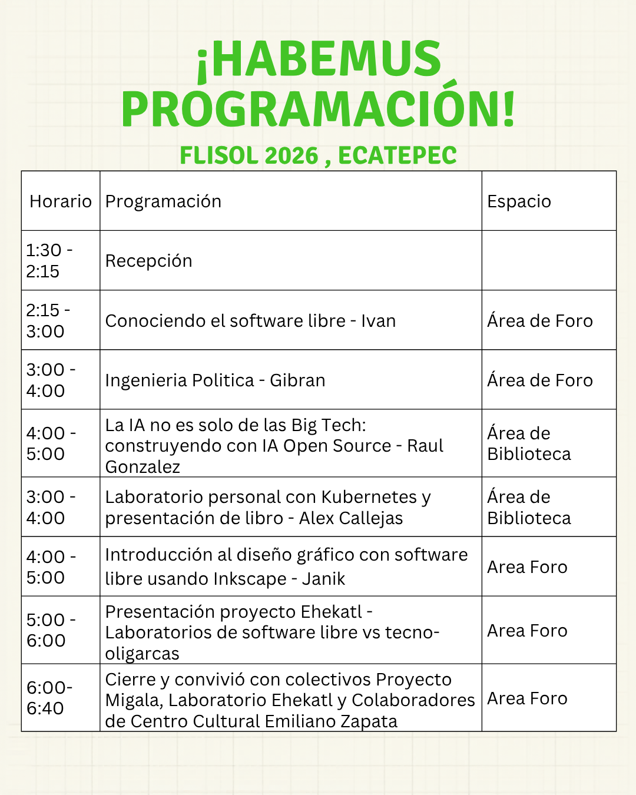

# FLISOL Ecatepec 2026

**Festival Latinoamericano de Instalación de Software Libre**

FLISOL es el evento de difusión de software libre más grande de Latinoamérica. Se realiza simultáneamente en múltiples ciudades y países, con el objetivo de promover el uso y conocimiento del software libre mediante charlas, talleres e instalaciones gratuitas.

## Sede Ecatepec

Ecatepec de Morelos, Estado de México, fue una de las sedes participantes en la edición 2026 del FLISOL.

### Actividades

- Instalación de sistemas operativos libres (GNU/Linux)
- Charlas sobre filosofía y herramientas de software libre
- Talleres prácticos para principiantes
- Demostración de aplicaciones de código abierto

### Cartel

## Galería del evento

