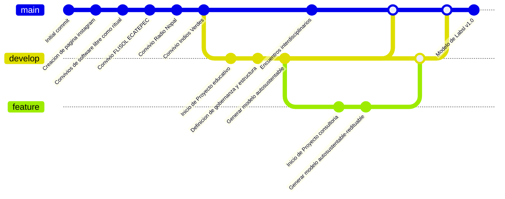

```mermaid
gitGraph
    commit id: "Initial commit"
    commit id: "Creacion de pagina instagram"
    commit id: "Convivios de software libre como ritual"
    commit id: "Convivio FLISOL ECATEPEC"
    commit id: "Convivio Radio Nopal"
    commit id: "Convivio Indios Verdes"
    branch develop
    commit id: "Inicio de Proyecto educativo"
    commit id: "Definicion de gobernanza y estructura"
    commit id: "Generar modelo autosustentable"
    checkout main
    commit id: "Encuentros interdisciplinarios"

    checkout develop
    branch feature
    commit id: "Inicio de Proyecto consultoria"
    commit id: "Generar modelo autosustentable-redituable"


    checkout main
    merge develop
    checkout develop
    merge feature
    checkout main
    merge develop

    commit id: "Modelo de Labsl v1.0"
```